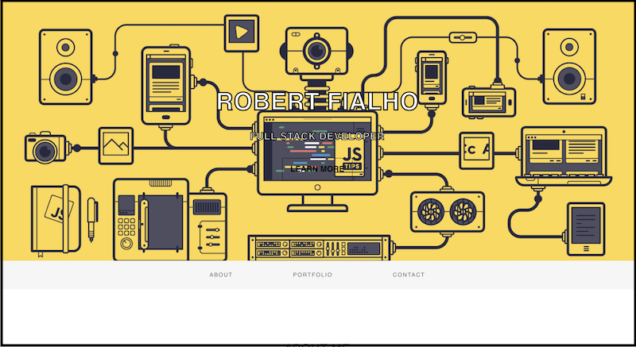
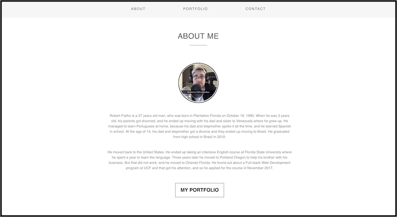
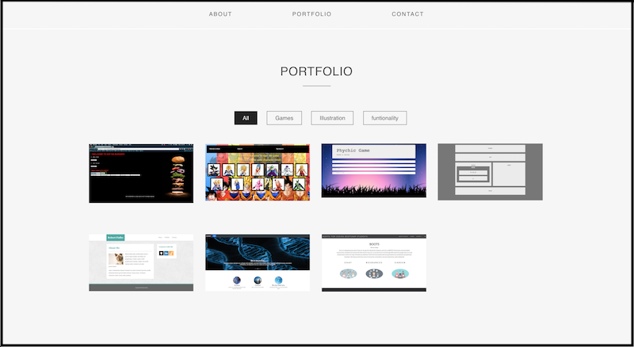
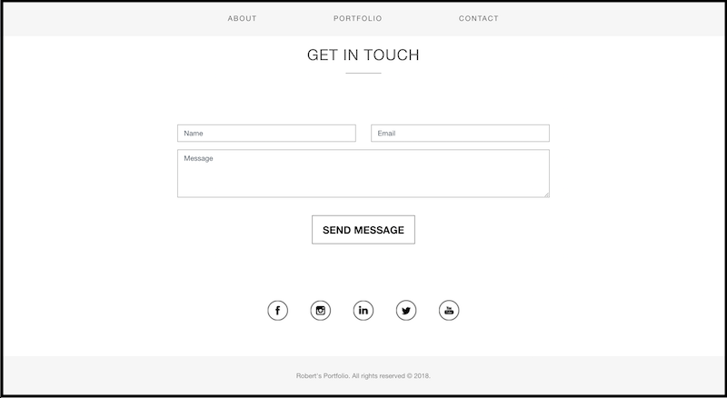

## Test my Portfolio.

https://robydoidao2006.github.io/Portfolio/

## What the Portfolio Looks Like.

## Aditional Information
- This project was built to hold all of my other projects and display them.

## This Webpage Was built Using:

- HTML
- CSS
- Javascrip
- Node.js
- Express
- Body Parser

## How to Run this Project Localy
- Option 1
- Clone / Download the repository.
- Unzip the file.
- Drag and drop the unzip folder on a text editor of your choice.
- Look for the index.html and get it to display on the text editor, right click and open on browser(or command b)
- Your default browser should open and load the Project automatically.

- Option 2
- Clone / Download the repository.
- Unzip the file.
- Open your command line
- Cd to the directory
- In the command line do "npm install" wait...
- Then do "node server.js"
- Your default browser should open and load the Project automatically.
- If not, just open the browser and type "http://localhost:8080/"

## Folder Structure

## Future Improvements
- Convert the whole project to React.
- Add a tree structure.
